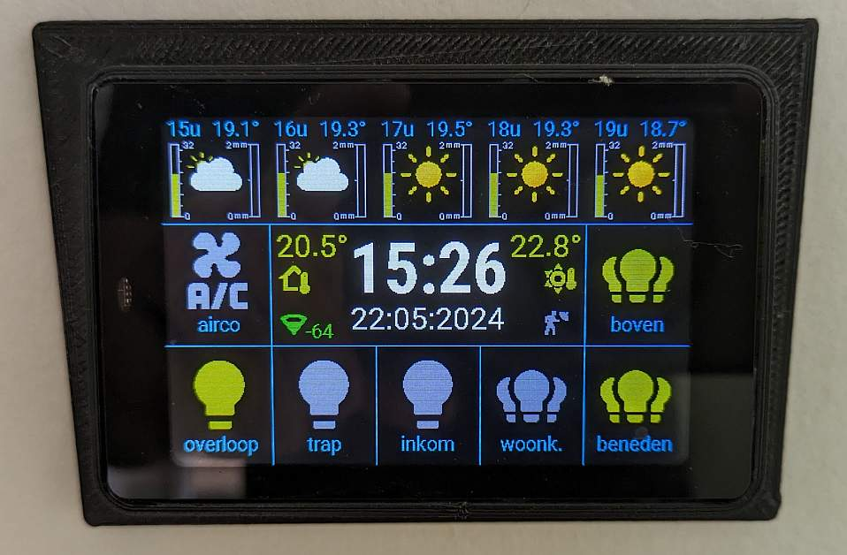

WT32SC01 display with Esphome and Home-Assistant
================================================
Example config for a WT32SC01 ( WT32-SC01 with ESP32 WRover module ) display using Esphome, controlling Home Assistant entities and using Home Assistant sensors to display Meteo forecast, temperatures,....

The meteo forecaste part is depending on a template sensor in Home Assistant. See ./sensor_ha/forecast_8hours.yaml. 
The images in ./images/weather1 should be places in the home assistant config/esphome/images/weather1 folder 

In the latest version I added a RCWL-0516 radar sensor behind the display to undim the screen... Also stopped using the 'delayed_on' and 'delayed_off' filters of the binary sensor to 'debounce' the touchscreen. Was not working for me....  Now using script with delay...

The code in this project is based on contributions of many others on https://community.home-assistant.io/!
 

