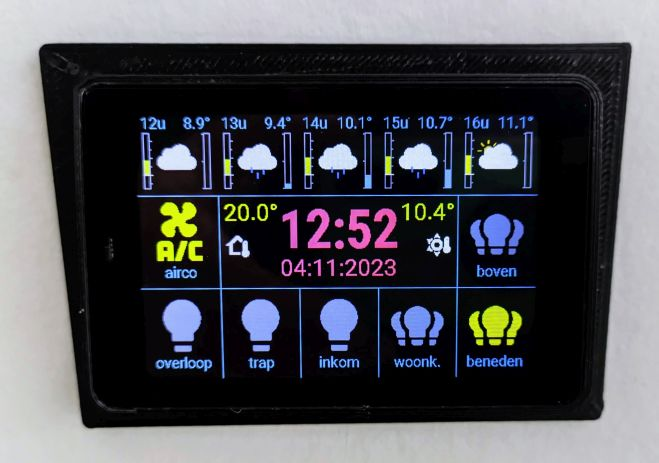

WT32SC01 display with Esphome and Home-Assistant
================================================
Example config for a WT32SC01 display using Esphome and controlling Home Assistant entities and using Home Assistant sensor to display Meteo forecast
 

